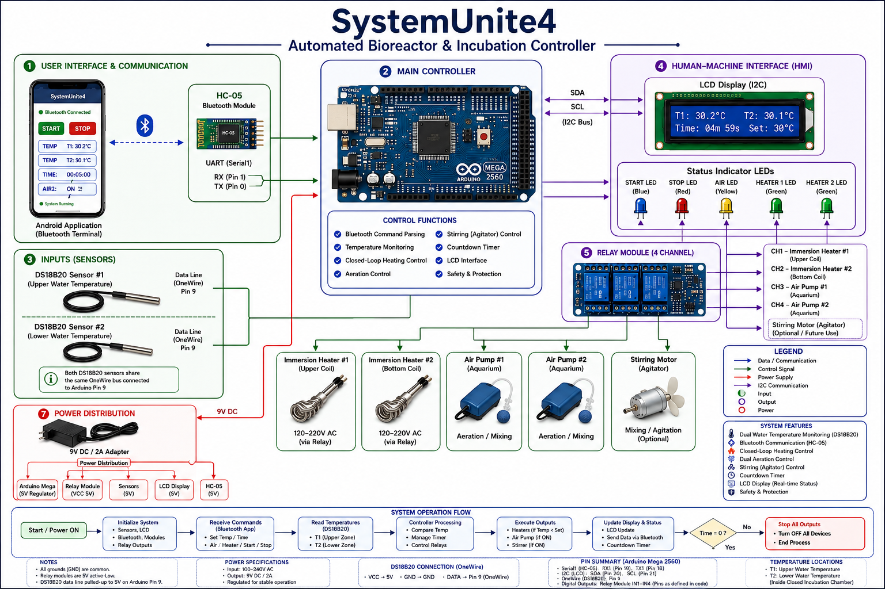

# 🧪 SystemUnite4
### Automated Bioreactor & Incubation Controller

  

---

## Overview

SystemUnite4 is an embedded master controller engineered to automate microbial incubation and bioprocess regulation using dual temperature monitoring, heating control, aeration management, Bluetooth telemetry, and an LCD user interface.

## Features

**SystemUnite4** is an embedded master controller engineered to automate micro-environmental incubation and bioprocess parameter regulation. The system features multi-zone digital temperature monitoring, automated heating actuators, dual-channel aeration management, and full wireless telemetry via Bluetooth.

---

## 🔬 System Overview & Architecture

The core firmware maintains closed-loop thermal regulation and timed gas injection for biological growth chambers (such as microbial incubators or bioreactors).

### Key Features
* **Dual-Zone Thermal Monitoring:** Interfaced with DS18B20 digital temperature sensors over Dallas OneWire protocol for high accuracy (T_1 and T_2).
* **Closed-Loop Actuation:** Dynamic switching for upper and bottom heating elements based on real-time temperature feedback against user-defined targets.
* **Dual Aeration System:** Multi-channel air generator control (`AIR1` / `AIR2`) to support aerobic fermentation or oxygenation cycles.
* **Wireless Telemetry (UART/Bluetooth):** Remote control interface (`Serial1`) receiving real-time commands (`START`, `STOP`, `TEMP`, `TIME`, `AIR`) and transmitting live diagnostics.
* **Local User Interface (I2C LCD):** High-contrast $16\times 2$ LCD screen utilizing I2C bus serialization (`0x27`) displaying real-time process indicators, setpoints, and countdown timers.

---

## ⚡ Hardware Pinout & Wiring Configuration

| Component / Subsystem | Pin Name | Arduino Pin | Description |
| :--- | :--- | :--- | :--- |
| **DS18B20 Sensors** | `ONE_WIRE_BUS` | Pin 9 | Digital temperature data bus (Dual Sensor) |
| **Blue Status LED** | `startLed` | Pin 24 | Operational state indicator |
| **Red Status LED** | `stopeLed` | Pin 25 | Emergency / Standby indicator |
| **Air Status LED** | `airGeneratorLed` | Pin 26 | Aeration active indicator |
| **Heater 1 Indicator** | `heaterLed1` | Pin 27 | Upper heater status LED |
| **Heater 2 Indicator** | `heaterLed2` | Pin 28 | Bottom heater status LED |
| **Aeration Relay 1** | `airGenerator1` | Pin 42 | Primary air injection relay |
| **Aeration Relay 2** | `airGenerator2` | Pin 43 | Secondary air injection relay |
| **Upper Heater Relay** | `upperHeater` | Pin 44 | Upper heating element actuator |
| **Bottom Heater Relay** | `bottomHeater` | Pin 45 | Lower heating element actuator |
| **I2C LCD Module** | `SDA / SCL` | Dedicated I2C | System status & display |
| **Bluetooth Module** | `Serial1 (RX1/TX1)` | Hardware UART | Remote telemetry interface |

---

## 📡 Wireless Bluetooth Serial Protocol (UART)

The system responds to incoming character strings structured as follows:

| Command Structure | Description / Example | Action Taken |
| :--- | :--- | :--- |
| `START` | `START` | Initiates closed-loop process & timer |
| `STOP` | `STOP` | Immediately cuts off all heaters and air pumps |
| `TEMP:<val>` | `TEMP:37` | Sets desired thermal threshold ($37^\circ\text{C}$) |
| `TIME:<sec>` | `TIME:1800` | Sets process execution timer ($1800\text{ seconds}$) |
| `AIR1:ON` / `AIR1:OFF` | `AIR1:ON` | Toggles primary aeration pump |
| `AIR2:ON` / `AIR2:OFF` | `AIR2:ON` | Toggles secondary aeration pump |

---

## 👥 Academic & Engineering Credits

### Academic Supervision
* **Prof. Dr.** Salah Badr
* **Dr.** Ragab Qasem💻
* **Mr.** Mostafa Fathy
* Note:
  Dr. Ragab Qasem is the main supervisor responsible for all scientific and 
     engineering aspects of the project.
  Prof. Dr. Salah Badr provided on-site facility 
     support.

## 🛠️ Installation & Dependencies

To compile and upload this project using the **Arduino IDE**:

1. Install the following libraries via the Arduino Library Manager:
   * `OneWire` (by Paul Stoffregen)
   * `DallasTemperature` (by Miles Burton)
   * `LiquidCrystal_I2C` (by Frank de Brabander)
2. Connect your **Arduino Mega 2560** or target microcontroller.
3. Select the correct COM port and upload `SystemUnite4.ino`.
